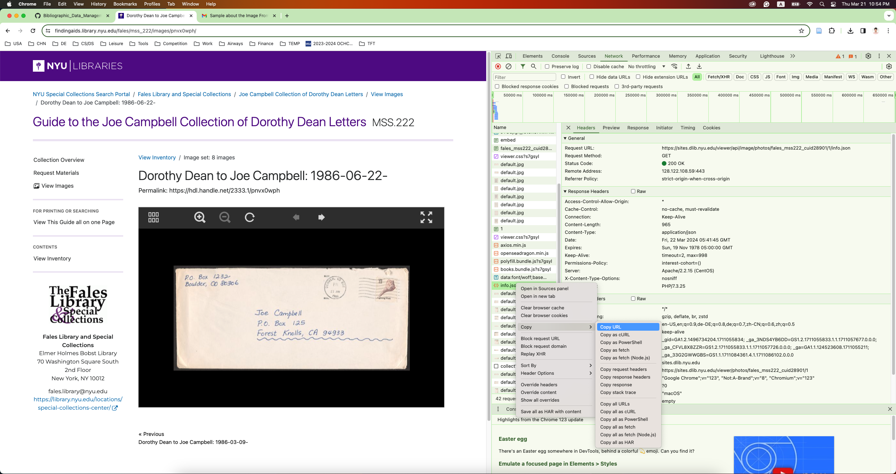

# Download From NYU Library

## Basic Logics

1. Get the info.json link **manually**
2. Parse the info.json and get the link for jp2
3. Modify jp2 link to access all the image in the collection

## Usage

1. Get info.json
    - It is located in **network tab** in Chrome Dev tools (F12).
    - Copy info.json path 
        
2. Set parameters
3. Run the script

## FAQ

Refer to [FAQ](./FAQ-download_NYU.md)
