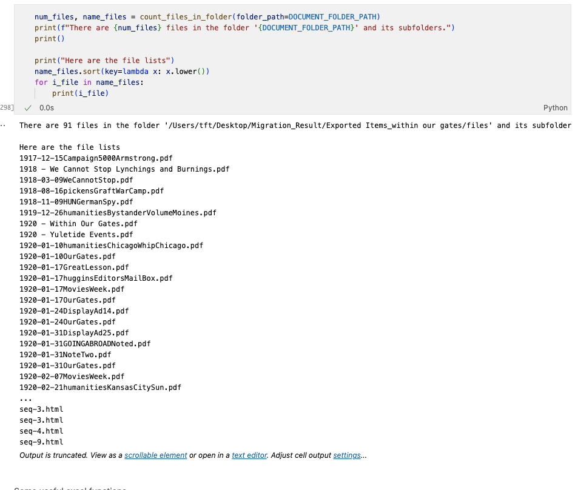
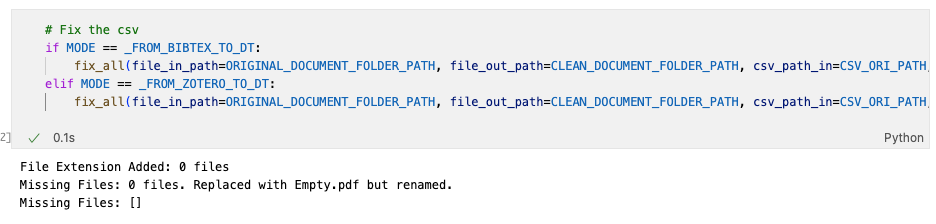

# Bibliographic Data Migration

This script automatically migrates all the bibliotic data from **Zotero** to **DEVONthink**, including the attachments and the metadata (author, dates, etc.).

## WARNING

It's strongly recommended to use Option 1 (Migrate from Zotero to DEVONthink), as the code for options 2 has not been used for a while, it might produce error during code iteration.

## Option 1: Migrate From Zotero to DEVONthink (Recommended)

### Basic Code Logics

1. Access the Zotero SQLite database to export the metadata of the documents as tsv, including file path (it needs extra ops to get)
2. We do the data cleaning
3. Import into DEVONthink with tsv and the documents
4. Verify the result. The number of the attachments to migrate, the number of missing files.

### Usage

1. Keep Zotero **closed**, otherwise the SQLite might be locked.
2. Make sure to keep DEVONthink **open** and **DO NOT** switch (click) other DEVONthink database when the code is running.
    - If you click the other DT database, the files might be loaded into that db.
3. Set the parameters at the beginning of the script

    - General parametes
        | Parameter | Meaning | Value | Notes |
        |-------------|-------------|-------------|-------------|
        | INSTALL_RELATED_LIBRARY | True to install the library when you run the script for the first time; False to skip installation | False, True | |
        | MODE | Choose what source you are trying to migrate from. _FROM_BIBTEX_TO_DT to migrate from Bibtex; _FROM_ZOTERO_TO_DT to migrate from Zotero (Recommended) | _FROM_BIBTEX_TO_DT, _FROM_ZOTERO_TO_DT | |

    - If you are migrating from Zotero to DT (MODE == _FROM_ZOTERO_TO_DT) 【This method is highly recommended.】

        | Parameter | Meaning | Value | Notes |
        |-------------|-------------|-------------|-------------|
        | Zotero_DATABASE_PATH | The path where Zotero SQLite Database (for metadata) is stored. | The path | If Zotero is installed locally, you don't have to change everytime. If you exported the sqlite from somewhere else, you need to point at that space. |
        | ZOTERO_STORAGE_PATH | The path where Zotero attachments are saved. | The path | If Zotero is installed locally, you don't have to change everytime. If you exported the sqlite from somewhere else, you need to point at that space. |
        | LIBRARY_NAME | The library name in Zotero you are trying to migrate | Library name | If there are special characters in the name, such as single quote and double quotes, make sure to use \ in accordance with python string rules |
        | COLLECTION_NAME | The collection name in Zotero you are trying to migrate | Collection name | It only works when you set LIBRARY_NAME as None (LIBRARY_NAME has a higher priority to be processed because it's more frequently used.). If COLLECTION_NAME is also set as None, process all the collections. | 
        | METADATA_TSV_NAME | The metadata tsv file | The path | You don't change this since it's only the tsv for reference when we export the metadata table from Zotero SQLite database. |
        | RESULT_FOLDER | The folder path where you save the migration result of this library or collection. | The path | You only change the root part of this path because it adapts the LIBRARY_NAME automatically. |
        | RESULT_FOLDER_DOCUMENTS | The folder path where you save the attachments | The path | You don't actually need those attachments since they are embedded into Devonthink database file. You only change the root part of this path because it adapts the LIBRARY_NAME automatically. |
        | EMPTY_PDF_PLACEHOLDER | Empty pdf path for those items in Zotero without attachments |  | The Empty.pdf is in the directory, but change the root directory. | 

    - If you are migrating from exported Bibtex to DT (MODE == _FROM_ZOTERO_TO_DT) 【This might change for different bibtex export methods】
        | Parameter | Meaning | Value | Notes |
        |-------------|-------------|-------------|-------------|
        | UNZIP_BASE_PATH | The path to the folder of unzipped exported files (including bib file) | | |
        | BIB_NAME | The bib file name | |

4. Run the Jupyter Notebook script
5. Check the output
    1. The number of attachments
        - 
        - In the end of the script, it outputs the number of attachments in Zotero for this library. 
        - Check if this matches the number shown in DevonThink.
    2. The number of missing files
        - 
        - In the middle of the script, it outputs the number of missing attachments in Zotero for this library and the name of the missing attachments.
        - Zotero has some items which only has the item for metadata but without attachmetns.
        - We will add an empty pdf as the placeholder these metadata individually.

## Option 2: From .bib file to DEVONthink

This method has not been used for a while, the code might have some errors after iterations.

### Basic Idea

1. We transform the bib into tsv and do the data cleaning
2. We use AppleScript to migrate the documents into DEVONthink

### Usage

1. We need to export .bib with the pdf files from Zotero at first
2. Set the script parameters
3. Run the script

## Tips

1. Make sure to open DEVONthink and DO NOT switch (click) other DEVONthink database during migration. Otherwise it might load the files into the wrong DT database. Simply just don't touch your laptop when the code is running.

## FAQ

[FAQ](./FAQ-Migration.md)

